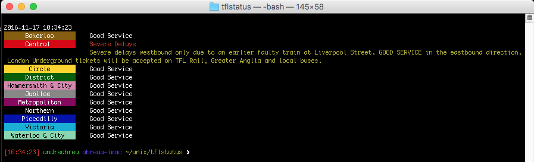

# tflstatus

An application to retrieve [tube status][tfl] from TFL and display the output in the UNIX terminal.



Dependencies
------------

* [cURL project's libcurl][libcurl] 
* [json-c parsing library][json-c]

[tfl]: https://api.tfl.gov.uk/line/mode/tube/status?detail=true
[json-c]: https://github.com/json-c/json-c
[libcurl]: http://curl.haxx.se/libcurl/

Features
--------

* Cross platform (tested on x86, ARM)
* Support for the official TFL Unified API
* Small code footprint

Tested Environments
-------------------

* Free BSD
* GNU Linux
* macOS X
* Raspberry Pi

If you have successfully tested this application on others systems or platforms please let me know!

Install
-------

To clone the repository you should have Git installed. Just run:

	$ git clone https://github.com/asabreu/tflstatus

To build the application, run `make`.

If build was successful, you should get a `tflstatus` binary.

#### Linking to `cURL` and `json-c`

The configured Makefile requires the system has installed `pkgconfig`.

#### Install pkg-config on macOS X with `Homebrew`

```
brew install pkg-config
```

#### Installation of development packages for `cURL` and `json-c` 

**macOS X with `Homebrew`:**

```
bash
    brew instal curl
    brew instal json-c
```

**Debian & Ubuntu Linux:**

```
bash
    sudo apt-get install libcurl4-gnutls-dev    
```

For `json-c` follow the provided [build instructions](https://github.com/json-c/json-c#build-instructions) to build from source.

Usage
-----

The syntax is quite simple:

```
./tflstatus [%]

[%]: Optional parameters
```

**Optional parameters:**

* **--help**  
Print this usage help.

* **--version**  
Print the application version.

Donations
---------

 If you want to support this project, please consider donating:
 
 * PayPal: [asabreu@yahoo.com](https://www.paypal.me/asabreu)
